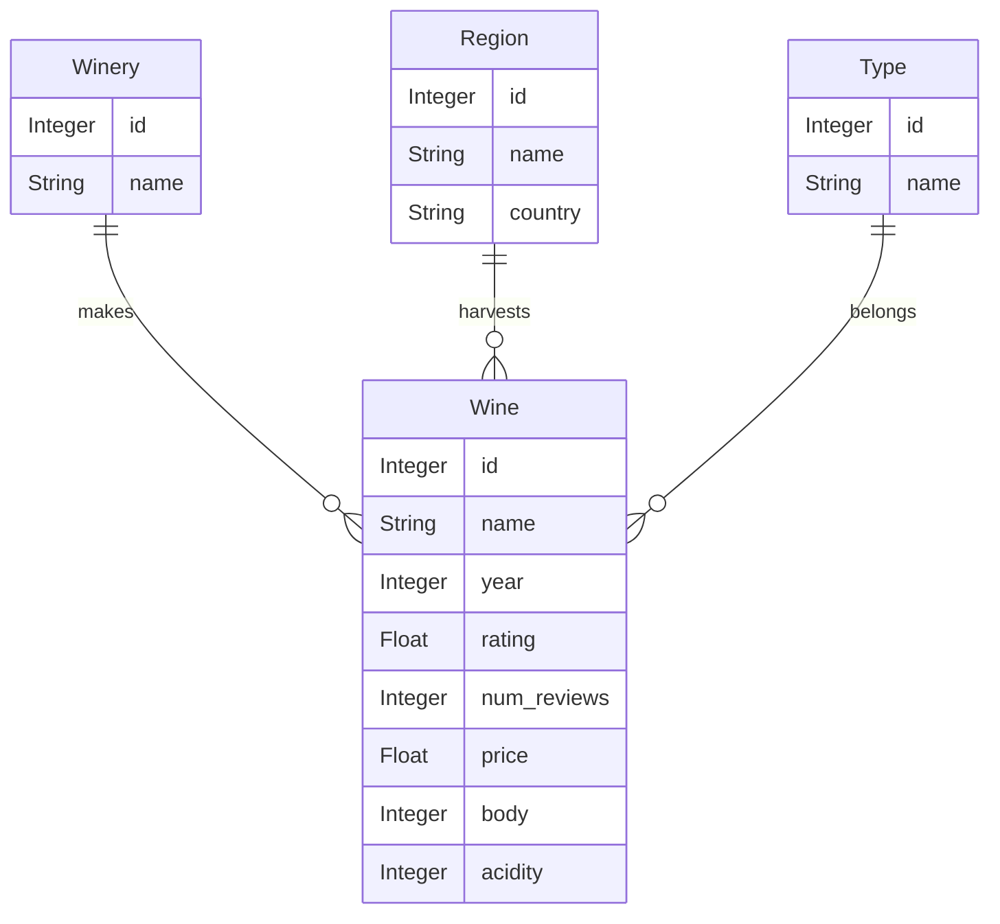

# Wine shop

* Normalize the given dataset wine_SPA.csv

* Build a RESTful API around the model

    * `/api/wine/{id}`
    * `/api/winery/{id}`
    * `/api/region/{id}`
    * `/api/type/{id}`

* Build unit tests

* Implement basic authentication

(Data attribution: [fedesoriano](https://www.kaggle.com/fedesoriano))